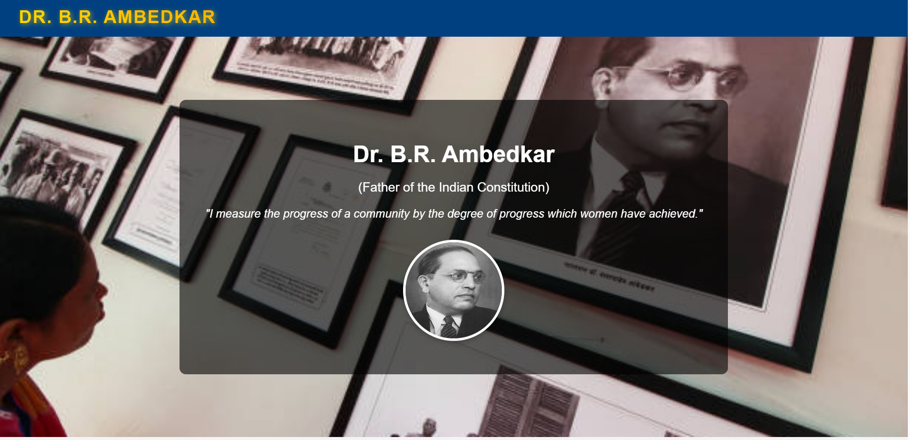
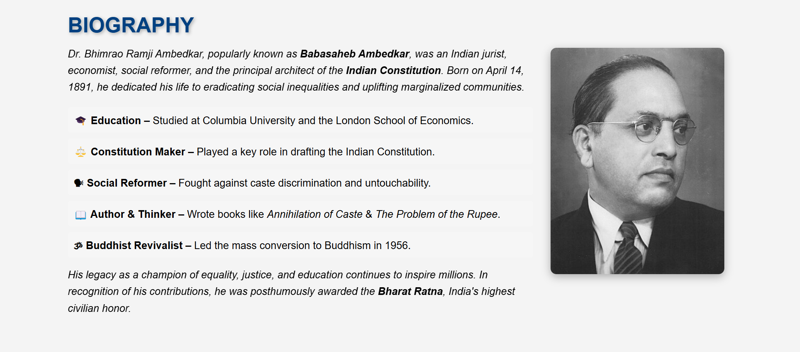
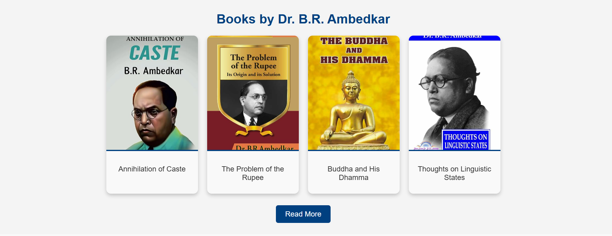

# Tribute Page for Dr. B.R. Ambedkar

## Project Description
This is a simple yet elegant **Tribute Page** dedicated to **Dr. B.R. Ambedkar**, created using **HTML, CSS, and JavaScript**. The page provides an overview of his life, achievements, and contributions to Indian society. It is designed with responsiveness and aesthetics in mind, making it visually appealing and easy to navigate.

## Features
- A well-structured layout with an attractive **hero section**
- **Biography section** highlighting his early life, education, and contributions
- **Achievements and contributions section** displaying his key works
- A **quotes section** showcasing his inspirational words
- Responsive design for better viewing on different devices
- Smooth scrolling and interactive elements using JavaScript

## Technologies Used
- **HTML** - For structuring the content
- **CSS** - For styling and layout
- **JavaScript** - For interactivity and smooth scrolling

## Installation and Usage
1. Clone the repository:
   ```sh
   git clone https://github.com/technical-jitendra-kumar/Tribute_Page_B.R-Ambedkar.git
   ```
2. Navigate to the project directory:
   ```sh
   cd Tribute_Page_B.R-Ambedkar
   ```
3. Open the `index.html` file in your browser.

## Screenshots





## Future Enhancements
- Add a **timeline** section with interactive elements
- Include a **video section** with speeches of Dr. B.R. Ambedkar
- Improve animations and transitions

## Contributing
If you would like to contribute, feel free to fork the repository and submit a pull request.

## License
This project is open-source and available under the **MIT License**.

## Contact
For any queries or suggestions, feel free to reach out:
- **Your Name:** Jitendra Kumar
- **Email:** jitendrakumarjjk10@gmail.com

